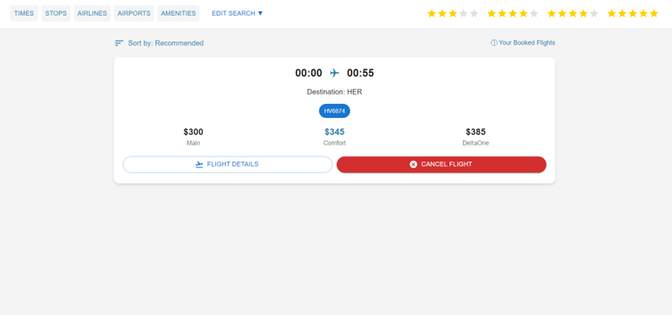
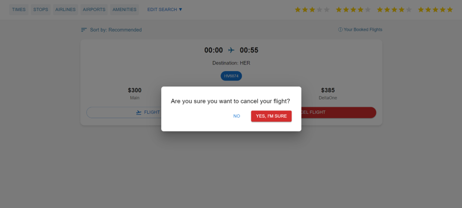

# flight-booking-system

# Screenshots proving that the project works

# Deployment
# Establishing a mongo db connection with the npm run start-server command in the project main root (Flight-Booking-System). 
# Starting the project locally(localhost:3000) with the npm start command in a new terminal in the same main root (Flight-Booking-System).
